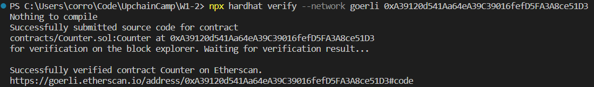

# Counter 项目

## 项目功能

该项目实现了以下功能：

1. ✅ 编写 Counter.sol 合约，实现仅有 owner 能调用 count() 函数的功能；
2. ✅ 添加 Counter.test.js 测试，测试只有 owner 能调用 count() 函数而 addr1 无法调用 count() 函数的场景；
3. ✅ 部署 Counter.sol 合约；
4. ✅ 验证 Counter.sol 合约；

## 问题列表

- 无法 Hardhat Verify
    
    - 问题：在合约验证上，目前只能实现 Etherscan 在线验证，使用代码验证会出现网络连接问题。
    
    - 解决方法: 在 hardhat.config.js 中添加终端代理即可，注意端口需要为10809。

    - 效果如下：
    
        