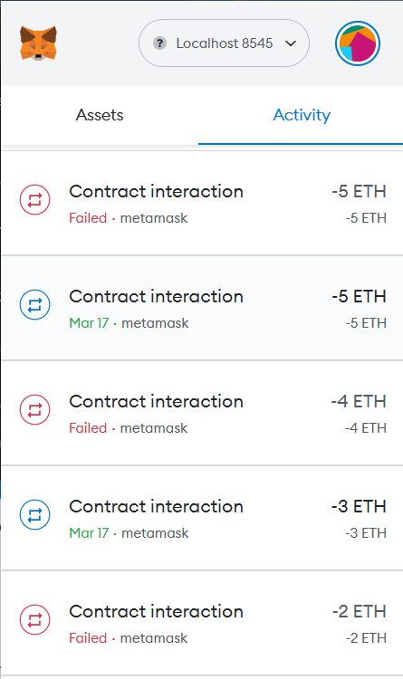
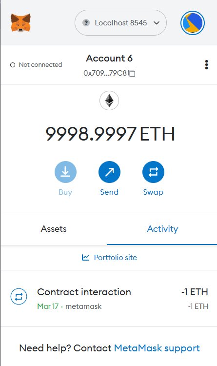

# Bank 项目

## 项目功能

🔻在 `Bank.sol` 智能合约中，实现了以下功能：

1. 接收转账：合约中添加了 `receive()` 和 `fallback()` 方法，从而能够直接接收 transfer() 类型的转账，并按照规定的方法处理错误。
2. 记录金额：合约中添加了 `deposit()` 方法，会在 `receive()` 被触发时调用，这样每一笔普通交易都会记录到 `currentBalances` 和 `totalBalances` 这两个 mapping 中。
3. 读取金额：合约中添加了 `getMyCurrentBalance()` 和 `getMyTotalBalance()` 这两种方法，能够区分合约创建者 `withdraw()` 前后的余额数量。
4. 提取金额：合约中添加了 `withdraw()` 方法，结合 `onlyOwner` 自定义修饰符，能够只让合约创建者调用该方法。

🔻在 `TestBank.sol` 合约中，将 `fallback()` 中的逻辑迁移到了 `deposit()` 中，提高了代码的可阅读性。

🔻在 scripts 目录中，定义了分别部署两种合约的脚本 `Bank.deploy.js` 以及 `TestBank.deploy.js`.

🔻在 `hardhat.config.js` 中，新增了 localhost 网络的配置。

## 我的尝试

1. 手动测试：通过运行 `npx hardhat console` 实现在控制台中，逐步运行 js 代码，并实现了三种交互方式：关联账户与合约、调用合约函数、以及查询合约余额。
2. 前端交互：通过 Metamask 钱包的本地网络+账户导入，做到直接向合约发起转账，效果如下：

    

## 资料

所有在开发中遇到的问题，都与 GPT-4 进行了交流，详见 [GPT-4: Bank.sol 问答记录](./assets/Band.sol_%E5%90%88%E7%BA%A6%E5%BC%80%E5%8F%91.md)。