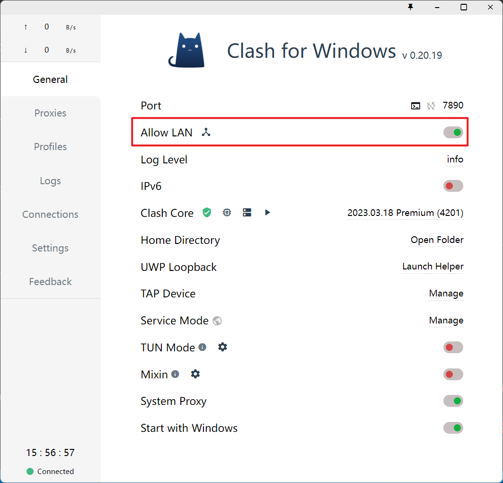

# Teacher and Score

本项目让 Teacher 作为代理合约，通过 IScore 接口访问 Score 合约的内容。

其中，三个合约的具体作用如下：

1. Teacher 合约是用户接口，因为 Teacher 合约的函数可读性比 Score 更好。
2. IScore 接口既为 Score 合约提供了函数和事件的规范，也限制了 Teacher 合约对 Score 合约的访问范围，从而让 Score 合约的编写以及 Teacher 合约的访问都更加标准化。
3. Score 合约用于存储用户数据，即学生成绩。

## 一、项目亮点

本项目的亮点之处有以下三点：

1. `transferOwnership` 函数：为了解决合约创建者权力过大的问题，我在 Score 合约中编写了 `transferOwnership` 函数，该函数只能执行一次，一旦被执行，Score 合约的 owner 将会从个人变成 Teacher 合约，而 Teacher 合约又没有提供 Score 合约 ower 的修改函数，因此 `transferOwnership` 使得 Score 合约只与 Teacher 合约进行绑定，因此会更加安全。

2. `IScore` 接口：接口的使用使得 Score 的设置更加规范化，也使得 Teacher 的访问也更加规范。

3. 错误处理：在 Score 合约中，添加了错误处理函数 `OnlyOwner()` 和 `InvalidScore()`, 相比于 `require()` 错误处理，更加节省 Gas, 可读性也更高。

## 二、个人收获

个人最大的收获有两点：

- 第一，学会了通过接口，来进行接口的实现和访问，即 Score 和 Teacher。
- 第二，学会了通过终端代理以及 Clash For Windows 的 Lan 模式来解决网络问题，比如：Hardhat Verify 以及 git push。

关于第二点，以下是详细解释。

### 1. Hardhat Verify

[Hardhat 成功验证](https://github.com/eiyen/UpchainCamp/commit/7c713b2a1e965d8026a73c87a733bec85fcb8014)得益于两点。

第一是在 `hardhat.config.js` 中添加以下代码：

```js
// hardhat.config.js
const { ProxyAgent, setGlobalDispatcher } = require("undici");
const proxyAgent = new ProxyAgent("http://127.0.0.1:7890");
setGlobalDispatcher(proxyAgent);
```

第二是在 Clash For Windows 中打开 Lan 模式：



最终进行 Hardhat Verify 时，效果如下

```bash
>>> npx hardhat verify --network goerli 0xB6A9489652BAA86f875C3E8F8d661615430573cC
The contract 0xB6A9489652BAA86f875C3E8F8d661615430573cC has already been verified


>>> npx hardhat verify --network goerli 0x12654299c33eD38cc3d235be0bd3ADCB623F6F50 "0xB6A9489652BAA86f875C3E8F8d661615430573cC"
Nothing to compile
Successfully submitted source code for contract
contracts/Teacher.sol:Teacher at 0x12654299c33eD38cc3d235be0bd3ADCB623F6F50
for verification on the block explorer. Waiting for verification result...

Successfully verified contract Teacher on Etherscan.
https://goerli.etherscan.io/address/0x12654299c33eD38cc3d235be0bd3ADCB623F6F50#code
```

### git push

由于翻墙软件从 v2RayN 换成了 Clash For Windws, 因此端口发生了改变，在直接翻墙时也发生了以下问题：

```bash
>>> git push
fatal: unable to access 'https://github.com/eiyen/UpchainCamp.git/': Failed to connect to 127.0.0.1 port 10809 after 2074 ms: Connection refused
```

这是因为端口号设置成了 v2RayN 的 10809 了，而现在的代理端口时 7890，因此我们需要先清除原先的设置，然后再设置新的本地代理端口。

```bash
# 清除代理设置
>>> git config --global --unset http.proxy
>>> git config --global --unset https.proxy

# 重新设置代理
>>> git config --global http.proxy http://127.0.0.1:7890
>>> git config --global https.proxy http://127.0.0.1:7890

# 检查代理设置
>>> git config --global --get http.proxy
>>> git config --global --get https.proxy
http://127.0.0.1:7890
http://127.0.0.1:7890
```

最后再将代码推送到远程仓库：

```bash
>>> git push
Writing objects: 100% (6/6), 2.42 KiB | 1.21 MiB/s, done.
# 省略后续输出结果
```